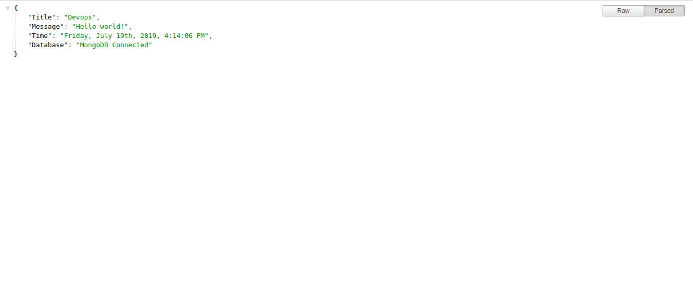

# express-monggodb
Expressjs with monggodb database. Simple app for devops workshop.

## Env
  * nodejs v8.10.0
  * monggodb

## Before Running
  * Edit connection database in file `config/key`

## Run
  * npm install
  * npm run dev

## Output
  Open `http://localhost:5000/` in your browser.  
  If the database is connected, the words `MongoDB Connected` will appear
  
